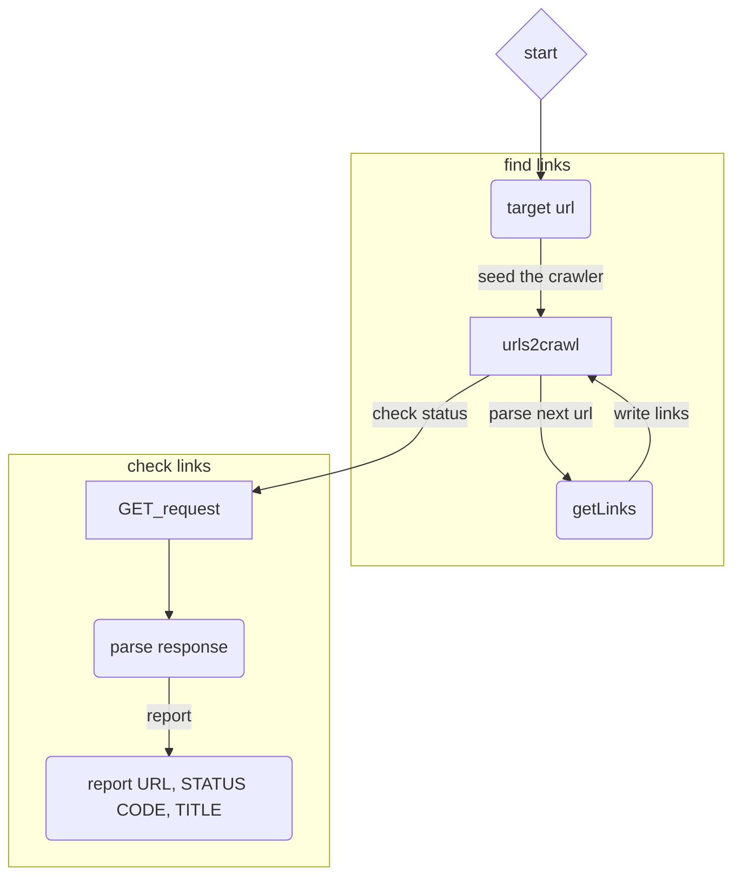

# OCC-Crawler

This is a basic web crawler intended to gather and report 
on links in the Jira and Confluence sites prior to and after migrating
from Nasdaq to OCC.

All you have to do is pass in the target URL (the URL at the
top of the tree you'd like to explore). This spider will only
check links found directly in the page. If you'd like it to dig
deeper, change the MAX_DEPTH value.

